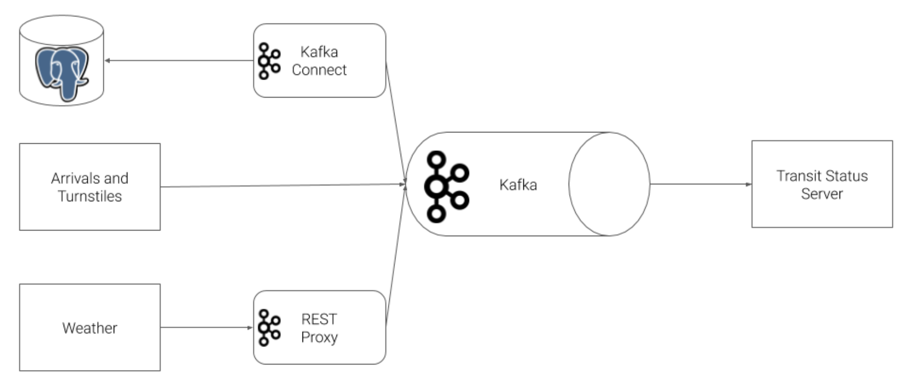
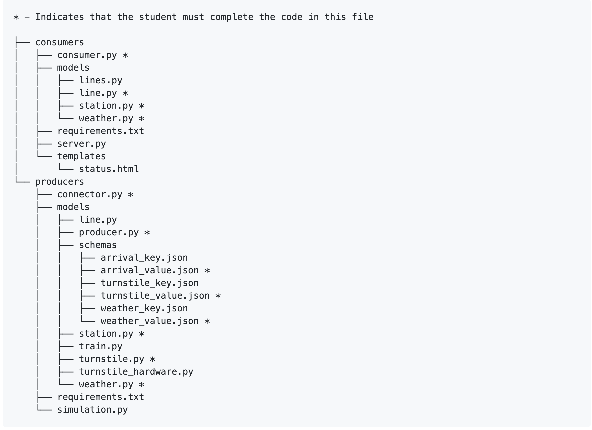
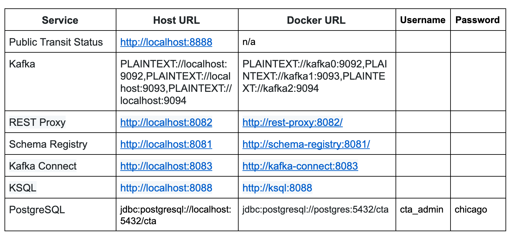

## Project Directions
The Chicago Transit Authority (CTA) has asked us to develop a dashboard displaying system status for its commuters. We have decided to use Kafka and ecosystem tools like REST Proxy and Kafka Connect to accomplish this task.

Our architecture will look like so:

Source tree:

Requirement to run at your machine:
